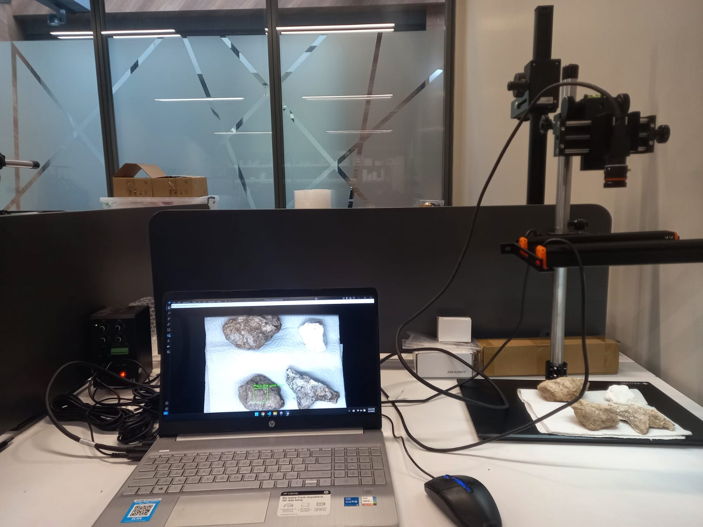

# Rock-Classification
Rock classification project at Aremak

# Rock Classification Using Machine Vision

## 1️⃣ Project Overview
This project aims to classify different types of rocks using computer vision and machine learning techniques. The goal is to develop an automated rock classification system that processes images, extracts relevant features, and predicts the rock type accurately.

### Key Objectives:
- Develop a classification model for rock identification.

- Utilize image processing techniques for feature extraction.

- Improve classification accuracy using machine learning techniques.

## 2️⃣ Equipment and Technologies Used

### Hardware Components:
-  **Camera Model:** Hikrobot MV-CS060-10UC-PRO
-  **Lens:** MVL-HF0828M-6MPE
-  **Camera Stand:** Aremak Adjustable Machine Vision Test Stand
-  **Lighting:** Hikrobot Bar light (MV-LLDS-H-250-40-W)
-  **Operating System:** Windows

### Software Tools:
-  **Programming Language:** Python
-  **Libraries:** OpenCV, NumPy, Scikit-learn, CSV
-  **SDK:** Hikrobot MVS SDK

## 3️⃣ Setup Photos 📸


## 4️⃣ Installation and Running Instructions 
### Installation:
Ensure you have Python installed (preferably version 3.7+), then install the necessary dependencies:

```sh
pip install opencv-python numpy scikit-learn matplotlib
```

### Running the Project:
1. Clone the repository:
   ```sh
   git clone https://github.com/your-repo/rock-classification.git
   cd rock-classification
   ```
2. Connect the Hikrobot camera and ensure the drivers are installed.
3. To run the classification script, execute:
   ```sh
   python Classification.py
   ```

   For classification with histogram approach:
   ```sh
   python Classification_with_histogram.py
   ```

   For classification with histogram and background removal:
   ```sh
   python Classification_with_background_removal.py
   ```
   
4. Follow the on-screen instructions to train the model or classify rocks.

## 5️⃣ Internship Acknowledgment
---
🏢 This project was developed during an internship at [Aremak Bilişim Teknolojileri](https://www.aremak.com.tr) under the supervision of Emrah Bala.


